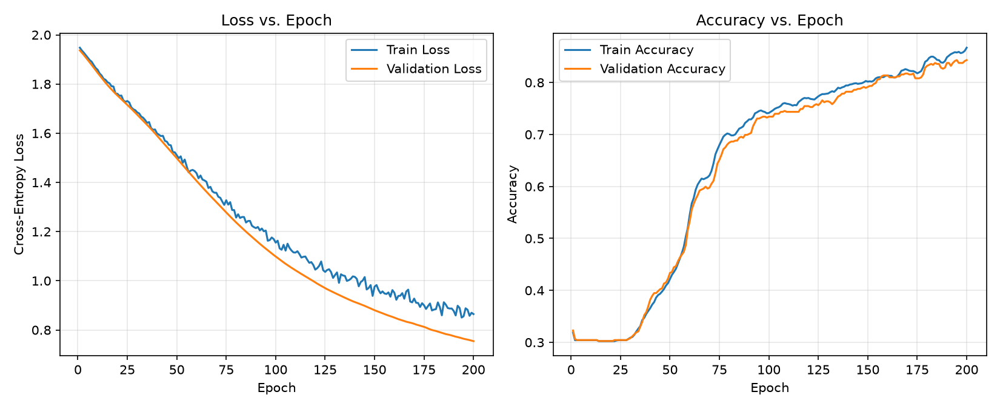
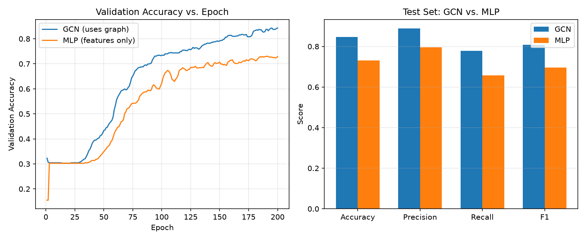

# Vanilla Graph Convolutional Network (GCN) on Cora

A from-scratch implementation of the standard 2-layer **Vanilla GCN**
(Kipf & Welling, ICLR 2017) for semi-supervised node classification, built
as a course project for **Machine Learning with Graphs** 

The goal of this repository is clarity, not performance: every file is
short, commented, and meant to be fully explainable in a viva. No advanced
GNN variants (GAT, GraphSAGE, transformers, attention, contrastive
learning, autoencoders, etc.) are used anywhere.
---

## 1. Task and Dataset

**Task:** Given a citation network, predict each paper's research topic
using both its own text content and its citation links to other papers.

**Dataset:** [Cora](https://linqs-data.soe.ucsc.edu/public/lbc/cora.tgz) — the
standard citation-network benchmark used in the original GCN paper.

| Property | Value |
|---|---|
| Nodes (papers) | 2,708 |
| Edges (citation links) | 5,429 |
| Node features | 1,433-dim binary bag-of-words |
| Classes | 7 research topics |

The raw dataset files (`cora.content`, `cora.cites`) are included under
[`data/cora/`](data/cora/), so the project runs immediately without any
manual download.

---

## 2. Model

A standard **2-layer Vanilla GCN**:

```
Z = softmax( A_hat . ReLU( A_hat . X . W0 ) . W1 )
```

- `A_hat` — symmetrically normalized adjacency matrix (fixed, precomputed, not learned)
- `X`     — node feature matrix
- `W0, W1` — learnable weight matrices of the two graph convolution layers

See [`src/gcn_model.py`](src/gcn_model.py) for the ~50-line implementation,
and [`docs/mathematical_modelling.md`](docs/mathematical_modelling.md) for
the derivation of every term above.

---

## 3. Repository Structure

```
vanilla-gcn/
├── data/cora/                    # Raw Cora dataset files
├── src/
│   ├── data_loader.py            # Parses cora.content / cora.cites
│   ├── preprocessing.py          # Builds & normalizes the adjacency matrix, train/val/test split
│   ├── gcn_model.py              # Vanilla 2-layer GCN (GraphConvolutionLayer + GCN)
│   ├── train.py                  # Training loop (loss, backprop, optimizer)
│   ├── evaluate.py               # Accuracy / precision / recall / F1 / confusion matrix
│   ├── mlp_model.py              # Feature-only baseline (no graph) for the ablation study
│   └── utils.py                  # Seeding, plotting, model save/load helpers
├── outputs/
│   ├── plots/training_curves.png # Sample training curve (checked in)
│   ├── plots/gcn_vs_mlp.png      # GCN vs. MLP comparison plot (checked in)
│   └── saved_models/             # Trained weights land here (gitignored)
├── main.py                       # End-to-end pipeline: load -> train -> evaluate -> save
├── load_and_evaluate.py          # Loads a saved checkpoint and re-evaluates it
├── compare_gcn_mlp.py            # Runs the GCN vs. MLP ablation experiment
└── requirements.txt
```

---

## 4. Setup

```bash
python3 -m venv .venv
source .venv/bin/activate        # Windows: .venv\Scripts\activate
pip install -r requirements.txt
```

## 5. Running the Pipeline

Train the model, evaluate it, and save a plot + checkpoint in one command:

```bash
python main.py
```

Optional hyperparameters (defaults match the original GCN paper):

```bash
python main.py --hidden_dim 16 --dropout 0.5 --lr 0.01 --weight_decay 5e-4 --epochs 200
```

Load the saved checkpoint later and re-evaluate without retraining:

```bash
python load_and_evaluate.py
```

Run the original GCN-vs-MLP ablation experiment (see Section 7 below):

```bash
python compare_gcn_mlp.py
```

---

## 6. Results

With default hyperparameters (200 epochs, hidden size 16, dropout 0.5,
Adam, lr = 0.01), on a stratified 60% / 20% / 20% train/val/test split:

| Metric | Value |
|---|---|
| Test Accuracy | ~0.85 |
| Precision (macro) | ~0.89 |
| Recall (macro) | ~0.78 |
| F1-score (macro) | ~0.81 |

Exact numbers vary slightly run to run due to weight initialization and
dropout, even with a fixed seed across different library versions. Full
per-class precision/recall/F1 and the confusion matrix are printed by
`main.py` and `load_and_evaluate.py`.

**Training curves** (loss and accuracy vs. epoch):



---

## 7. Original Analysis: Does the Graph Actually Help?

Beyond reproducing the standard GCN, this project includes an independent
ablation: an MLP baseline with identical hidden size, dropout, optimizer,
epochs, seed, and data split — the *only* difference is that it classifies
each paper from its own word-features alone, with no access to the
citation graph at all.

| Metric | Vanilla GCN | MLP baseline (no graph) | Gain from graph |
|---|---|---|---|
| Accuracy | 0.8469 | 0.7306 | **+0.1162** |
| Precision (macro) | 0.8889 | 0.7962 | +0.0928 |
| Recall (macro) | 0.7784 | 0.6569 | +0.1216 |
| F1-score (macro) | 0.8087 | 0.6963 | +0.1123 |



---

## 8. Design Choices and Simplifications

These are deliberate, documented simplifications appropriate for a course
project (each is explained further in the mathematical modelling doc):

- **Undirected graph.** Citation direction is discarded; only the presence
  of a link matters.
- **Dense matrices, not sparse tensors.** Cora is small (2708 nodes), so a
  dense `(N, N)` adjacency matrix is used throughout for clarity, instead
  of a sparse tensor format.
- **Stratified random split (60/20/20)** instead of the original paper's
  fixed 140/500/1000 split, since a simple percentage-based split is
  easier to explain and reason about while remaining methodologically
  sound.
- **Fixed number of epochs**, no early stopping — keeps the training loop
  a single, easy-to-read `for` loop.

---

## 9. References

1. T. N. Kipf and M. Welling, *"Semi-Supervised Classification with Graph
   Convolutional Networks,"* ICLR 2017. [arXiv:1609.02907](https://arxiv.org/abs/1609.02907)
2. A. K. McCallum et al., *"Automating the Construction of Internet Portals
   with Machine Learning,"* Information Retrieval, 2000. (Original Cora dataset)
3. W. L. Hamilton, *Graph Representation Learning*, Morgan & Claypool, 2020.

